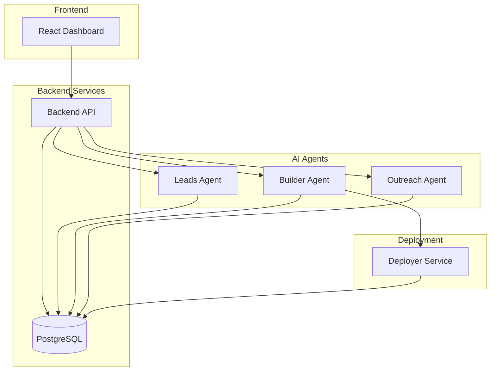

# LeadForge

LeadForge is an AI-Powered Sales Development Representative (SDR) Platform designed to automate the entire sales pipeline, from lead generation and analysis to personalized outreach and asset creation.

Built for HackOHIO 2025, LeadForge empowers agencies and businesses to find potential clients, analyze their digital presence, automatically build improved website prototypes, and reach out via email and AI-driven voice calls.

## Key Features

*   **Automated Lead Generation:** Scours Google Maps to find businesses in specific niches and locations.
*   **Intelligent Lead Analysis:** Scrapes prospect websites, takes screenshots, and uses AI to critique their design and content.
*   **AI Website Builder:** Automatically generates a modern, improved version of the prospect's website (landing page) based on the analysis.
*   **Multi-Channel Outreach:** Orchestrates personalized outreach campaigns using AI-drafted emails and real-time AI voice calls (via Twilio and Pipecat AI).
*   **Comprehensive Dashboard:** A modern React-based UI to manage campaigns, view leads, and track outreach status.

## Architecture

LeadForge follows a microservices architecture, with specialized agents handling different parts of the SDR workflow. All services are containerized using Docker and orchestrated via Docker Compose.



### Tech Stack

*   **Frontend:** React, TypeScript, Vite, Tailwind CSS, Radix UI.
*   **Backend & Agents:** Python, FastAPI.
*   **AI Orchestration:** LangChain, LangGraph.
*   **AI Models:** Google Gemini (via `langchain-google-genai`), Voice AI (Pipecat AI).
*   **Database:** PostgreSQL.
*   **Infrastructure:** Docker, Docker Compose.
*   **External APIs:** Google Maps API, Twilio (Voice/SMS), OpenAI/Cartesia/Deepgram (Voice Synthesis).

## Services Breakdown

| Service | Directory | Description |
| :--- | :--- | :--- |
| **Backend** | `/backend` | The central API gateway and coordinator for the platform. |
| **Leads** | `/leads` | **Agentic Workflow:** `Generate Leads` -> `Analyze Leads`. <br> Uses Google Maps to find prospects and analyzes their current website using scraping and visual AI. |
| **Builder** | `/builder` | **Agentic Workflow:** `Scrape` -> `Screenshot` -> `Prompt` -> `Build`. <br> Takes a prospect's URL, analyzes it, and generates a new, modern website zip file. |
| **Outreach** | `/outreach` | **Agentic Workflow:** `Draft Email` -> `Send Email` -> `Phone Call`. <br> Handles communication using AI-generated emails and interactive voice calls. |
| **Deployer** | `/deployer` | Deploys and serves the static websites generated by the Builder agent. |
| **Frontend** | `/frontend` | The user interface for interacting with the platform. |

## Getting Started

### Prerequisites

*   **Docker** and **Docker Compose** installed.
*   **Make** (optional, for using the `Makefile`).
*   **Python 3.13+** (if running locally without Docker).
*   **Node.js 20+** (if running frontend locally).

### Environment Setup

1.  **Clone the repository.**
2.  **Create Environment Files:**
    Copy the example environment files to their respective `.env` files:
    ```bash
    cp .env.dev.example .env.dev
    # Configure your API keys in .env.dev (Google Maps, Gemini, Twilio, etc.)
    ```
    For production, use `.env.prod.example`.

### Running with Docker (Recommended)

Use the provided `Makefile` for easy management.

1.  **Start Development Environment:**
    ```bash
    make dev
    # Or manually: docker-compose -f docker-compose.dev.yml up --build -d
    ```
    This will start all services (Backend, Frontend, Leads, Builder, Outreach, Deployer, DB) with hot-reloading enabled.

2.  **Access the Application:**
    *   **Frontend Dashboard:** [http://localhost:5173](http://localhost:5173)
    *   **Backend API Docs:** [http://localhost:8000/docs](http://localhost:8000/docs)
    *   **Leads Service Docs:** [http://localhost:8001/docs](http://localhost:8001/docs)
    *   **Builder Service Docs:** [http://localhost:8002/docs](http://localhost:8002/docs)
    *   **Deployer Service Docs:** [http://localhost:8003/docs](http://localhost:8003/docs)
    *   **Outreach Service Docs:** [http://localhost:8004/docs](http://localhost:8004/docs)

3.  **View Logs:**
    ```bash
    make dev-logs
    # Or specific service: make dev-logs-backend
    ```

4.  **Stop Containers:**
    ```bash
    make dev-down
    ```

### Useful Make Commands

*   `make help`: Show all available commands.
*   `make dev-shell-backend`: Open a shell inside the backend container.
*   `make dev-shell-db`: Open a `psql` shell for the database.
*   `make prune`: Clean up Docker resources.

### Email Setup

For testing email functionality, the system currently defaults to a logging mode. To configure real email sending or to troubleshoot email features, refer to:
*   `frontend/EMAIL_SETUP_GUIDE.md`: Comprehensive guide for troubleshooting and setting up Gmail API.
*   `frontend/EMAIL_SETUP.md`: Quick setup instructions for testing.

## Contributors

*   **Harikeshav R**
*   **Rahul Sanghvi**
*   **Praj Sachan**

---
Created for HackOHIO 2025
